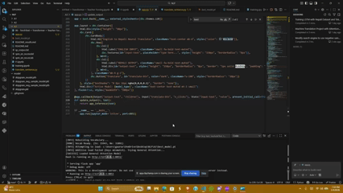
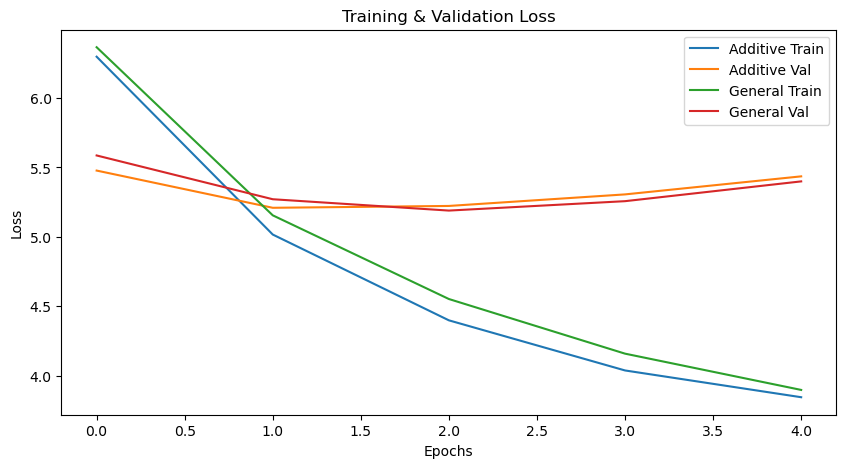

# English-to-Nepali Neural Machine Translation 🇳🇵

This project implements a Sequence-to-Sequence (Seq2Seq) Neural Machine Translation model to translate English sentences into Nepali. The system uses a **Bidirectional GRU Encoder** and a **Unidirectional GRU Decoder**.

The core of this experiment is a comparative analysis of two different attention mechanisms—**General (Luong)** and **Additive (Bahdanau)**—to determine which architecture better captures the linguistic nuances between English and Nepali.

## 🎥 App Demo
The project includes a web application (built with Dash) that serves the trained model for real-time translation.



---

## 📊 Dataset & Preprocessing

We utilized the `CohleM/english-to-nepali` dataset. To optimize for training time and memory constraints, a subset of the data was used for this experiment.

| Metric | Count |
| :--- | :--- |
| **Train Set Size** | 42,560 sentences |
| **Validation Set Size** | 5,320 sentences |
| **Test Set Size** | 5,320 sentences |
| **English Vocabulary** | 15,943 tokens |
| **Nepali Vocabulary** | 31,091 tokens |

**Preprocessing Steps:**
1.  **Tokenization**: `spaCy` for English, white-space splitting for Nepali.
2.  **Vocab Building**: Minimum frequency threshold of 2.
3.  **Special Tokens**: `<sos>`, `<eos>`, `<unk>`, `<pad>` handling.

---

## 🧠 Model Comparison: General vs. Additive Attention

The following table contrasts the two attention mechanisms implemented in this project.

| Feature | General Attention (Luong) | Additive Attention (Bahdanau) |
| :--- | :--- | :--- |
| **Equation** | $$score(s_t, h_i) = s_t^T W_a h_i$$|$$score(s_t, h_i) = v_a^T \tanh(W_a [s_t; h_i])$$ |
| **Mechanism** | **Multiplicative:** Calculates alignment using a dot product between the decoder state and encoder states (via a weight matrix). | **Concatenative:** Concatenates decoder and encoder states, passing them through a feed-forward neural network (Linear $\to$ Tanh $\to$ Linear). |
| **Complexity** | **Lower:** Matrix multiplication is computationally faster and memory-efficient. | **Higher:** Requires evaluating a non-linear $\tanh$ layer for every encoder state at every decoding step. |
| **Global vs Local** | Often better at capturing global context due to the direct dot product path. | typically excels at local alignment and handling complex word-order changes (non-linear relationships). |
| **Decoder State** | Uses the **current** decoder hidden state ($s_t$). | Uses the **previous** decoder hidden state ($s_{t-1}$). |

---

## 📈 Evaluation & Findings

The models were trained for 5 epochs. We tracked **Cross Entropy Loss** and **Perplexity (PPL)** on the validation set.

### Training Logs
| Epoch | Model | Train Loss | Val Loss | Val PPL |
| :--- | :--- | :--- | :--- | :--- |
| **1** | Additive | 6.298 | 5.478 | 239.29 |
| | General | 6.367 | 5.587 | 266.81 |
| **2** | Additive | 5.017 | 5.209 | 182.99 |
| | General | 5.155 | 5.271 | 194.62 |
| **3** | **Additive** | 4.398 | 5.223 | 185.44 |
| | **General** | **4.552** | **5.189** | **179.35** 🏆 |
| **4** | Additive | 4.037 | 5.306 | 201.53 |
| | General | 4.158 | 5.257 | 191.93 |
| **5** | Additive | 3.844 | 5.436 | 229.51 |
| | General | 3.897 | 5.400 | 221.33 |

### Key Findings
1.  **Winner:**  **General Attention** achieved the lowest validation loss (**5.189**) and perplexity (**179.35**) at Epoch 3, making it the selected model for the application.
2.  **Convergence:** Additive Attention started stronger (lower loss in Epoch 1 & 2), likely because its non-linear layer allows it to learn alignments faster initially.
3.  **Overfitting:** Both models began to overfit after Epoch 3, as indicated by the Training Loss decreasing (down to ~3.8) while Validation Loss started increasing again (up to ~5.4). This suggests that **Early Stopping** at Epoch 3 is optimal.

### Visualizations
*(Generated from t1.ipynb)*

**Loss Curves:**



---

## 🛠️ Project Structure

* `t1.ipynb`: Main notebook containing data loading, model definition, training loop, and evaluation.
* `app.py`: Standalone Dash application for inference.
* `best_model.pt`: Saved weights of the best performing model (General Attention).
* `README.md`: Project documentation.

##  How to Run

1.  **Training**: Run the notebook to train models and generate `best_model.pt`.
    ```bash
    jupyter notebook t1.ipynb
    ```
2.  **Inference App**: Launch the web interface.
    ```bash
    python app.py
    ```
    Access at: `http://127.0.0.1:8051`