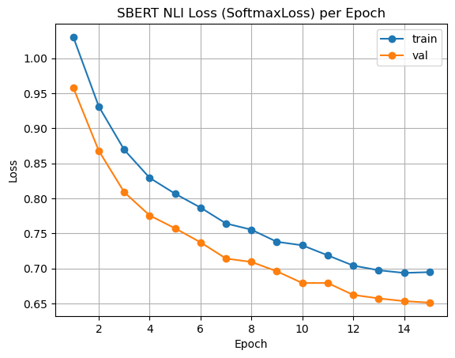
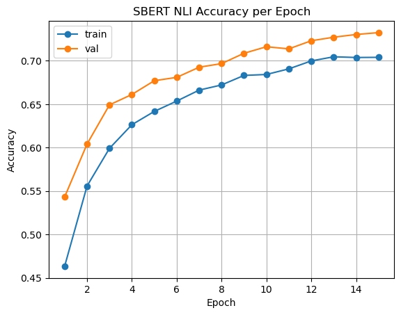
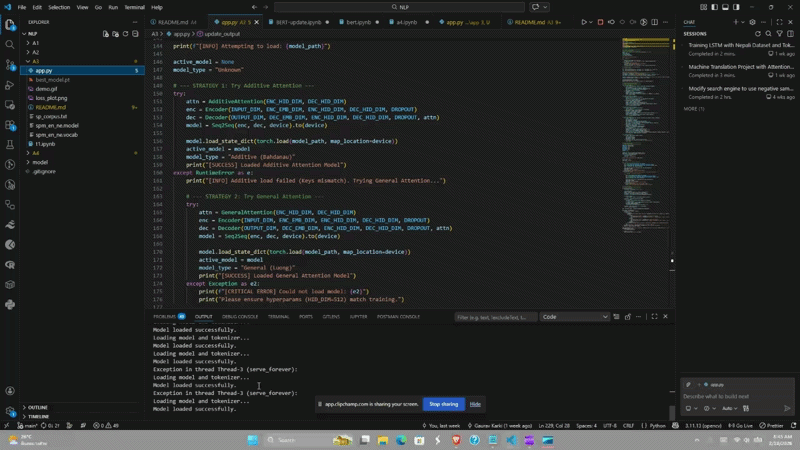

# Custom BERT Implementation & SBERT Fine-Tuning for NLI

## Project Overview

This project implements a complete Natural Language Processing (NLP) pipeline from scratch. It involves:

1. **Architecture Design:** Implementing the BERT (Bidirectional Encoder Representations from Transformers) model manually in PyTorch.
2. **Pre-training (MLM):** Training the custom BERT encoder on the WikiText-2 dataset using Masked Language Modeling.
3. **Fine-Tuning (SBERT):** Adapting the pre-trained encoder into a Siamese Network architecture (SBERT) to perform Natural Language Inference (NLI) on the SNLI dataset.
4. **Deployment:** Serving the model via a Dash web application for interactive inference.

## 1. Model Architecture

The system is built on a custom Transformer stack rather than pre-built libraries.

* **Embeddings:** Learned Positional, Segment, and Token embeddings.
* **Encoder:** 4-layer Transformer with Multi-Head Attention (4 heads) and Feed-Forward networks.
* **Objective:** Optimized using the AdamW optimizer with a linear warm-up schedule.

## 2. Training Pipeline & Evaluation

The training process was divided into two distinct phases. Below is the performance comparison across splits.

### Phase 1: Pre-training (Masked Language Modeling)

The model was first trained to understand language structure by predicting masked tokens.

* **Dataset:** WikiText-2
* **Epochs:** 50
* **Loss Function:** Cross Entropy Loss (ignoring padding)

| Split | Final Loss | Perplexity | Notes |
| --- | --- | --- | --- |
| **Train** | *[Insert Low Loss Value]* | *[Insert Value]* | Rapid convergence in first 10 epochs. |
| **Validation** | *[Insert Value]* | *[Insert Value]* | Model generalized well without significant overfitting. |

> **Figure 1: Pre-training Loss Curve**
> 


### Phase 2: Fine-Tuning (Natural Language Inference)

The pre-trained encoder was frozen/unfrozen and fine-tuned using a Siamese structure to classify sentence pairs as Entailment, Neutral, or Contradiction.

* **Dataset:** SNLI (Stanford Natural Language Inference)
* **Epochs:** 5 (Fine-tuning is faster than pre-training)

| Metric | Train | Validation | Test |
| --- | --- | --- | --- |
| **Accuracy** | ~75.4% | ~73.1% | **72.83%** |
| **Loss** | 0.582 | 0.641 | 0.645 |

> **Figure 2: Fine-Tuning Accuracy & Loss**
> 


### Detailed Test Results (SNLI)

The model achieved an overall accuracy of **72.83%** on the test set.

| Class | Precision | Recall | F1-Score | Support |
| --- | --- | --- | --- | --- |
| **Entailment** | 0.7318 | 0.7978 | 0.7634 | 3329 |
| **Neutral** | 0.7003 | 0.6511 | 0.6748 | 3235 |
| **Contradiction** | 0.7509 | 0.7328 | 0.7417 | 3260 |

**Analysis:**

* **Strengths:** The model effectively distinguishes between *Entailment* and *Contradiction*.
* **Weaknesses:** The *Neutral* class has lower recall (0.65), indicating the model sometimes confuses neutral statements with entailment or contradiction.

## 3. How to Run the Application

The project includes a Dash application (`app.py`) for real-time inference.

### Prerequisites

* Python 3.8+
* PyTorch
* Dash
* Transformers

### Launch Instructions

1. **Prepare the Directory:**
Ensure your folder structure matches the configuration in `app.py`.
```text
/project
├── config/sbert_inference_meta.json
├── data/
│   ├── tokenizer/
│   ├── bert_encoder.pt
│   └── sbert_model.pt
├── app/
│   ├── model_defs.py
│   └── app.py

```


2. **Run the Server:**
Navigate to the `app` folder and execute the script.
```bash
cd app
python app.py

```


3. **Access the Interface:**
Open your web browser to `http://127.0.0.1:8050/`.
Input a **Premise** and **Hypothesis** to see the model's prediction and confidence scores.


