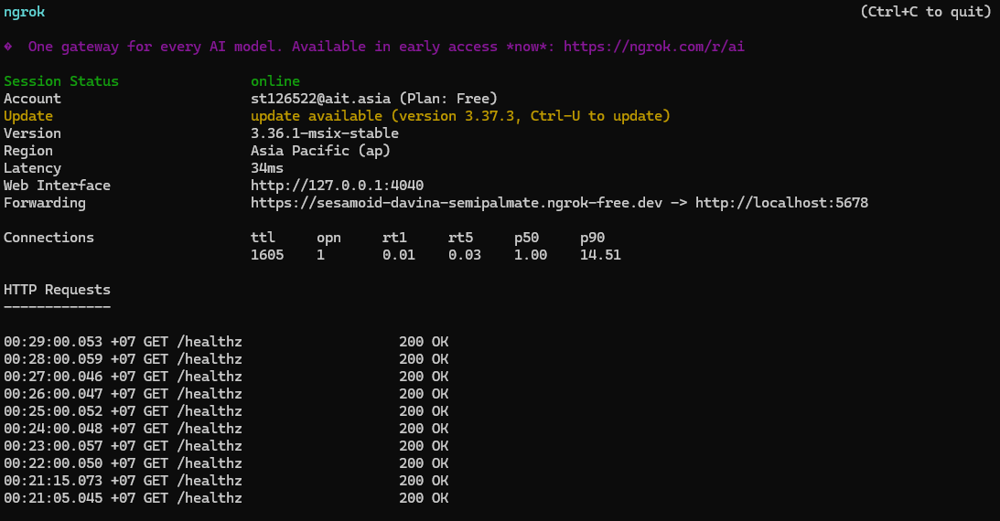
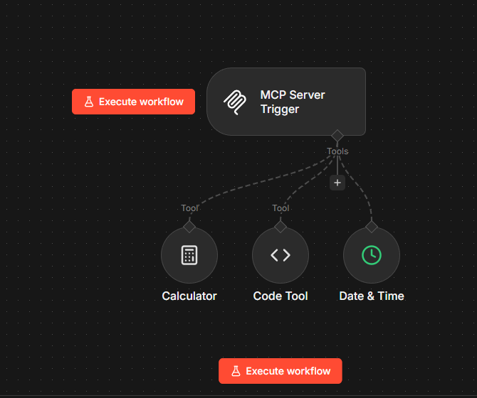
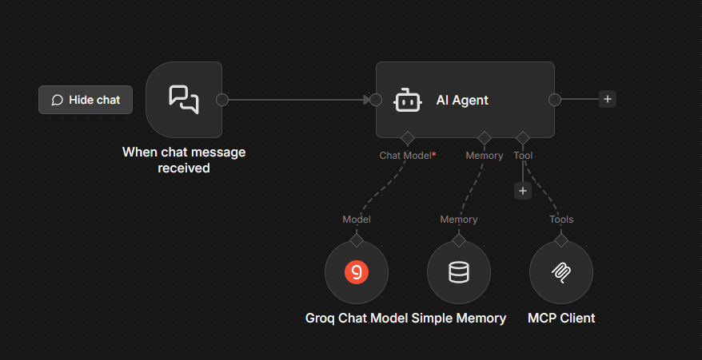
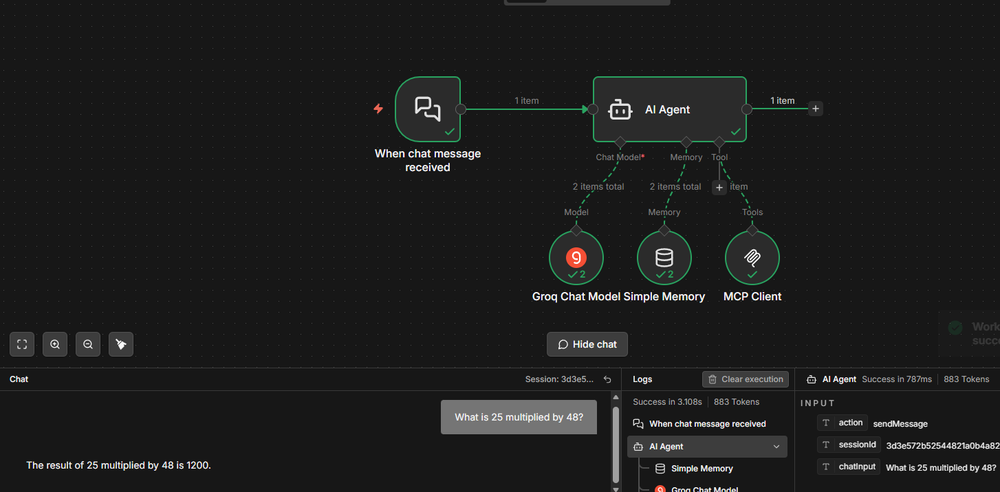
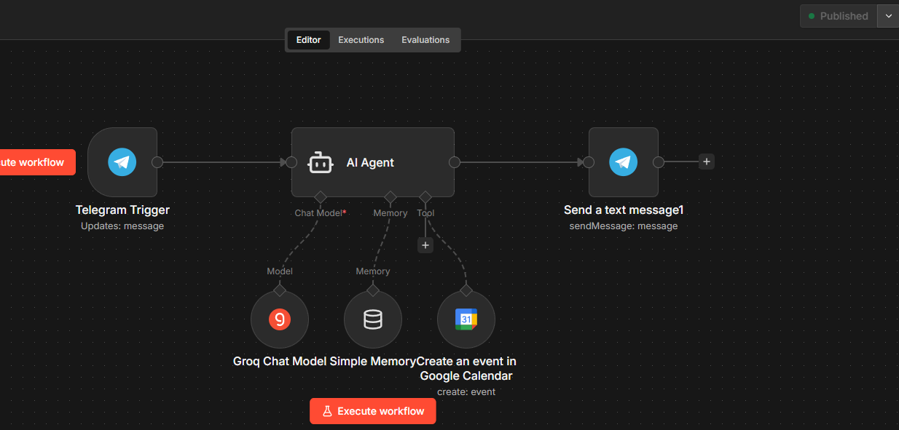
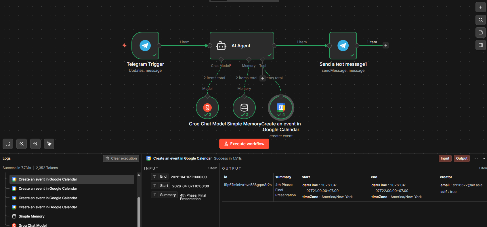
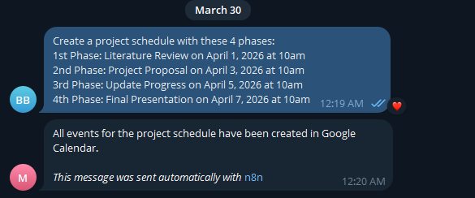
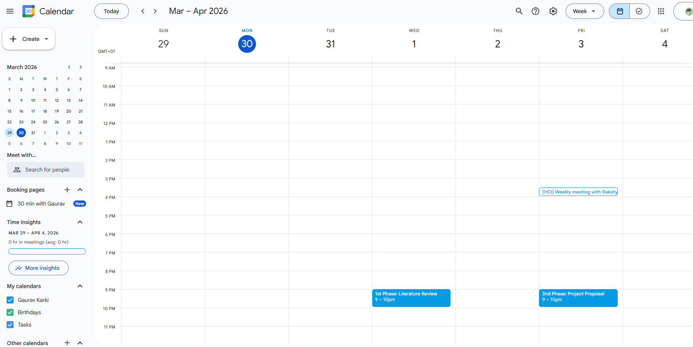
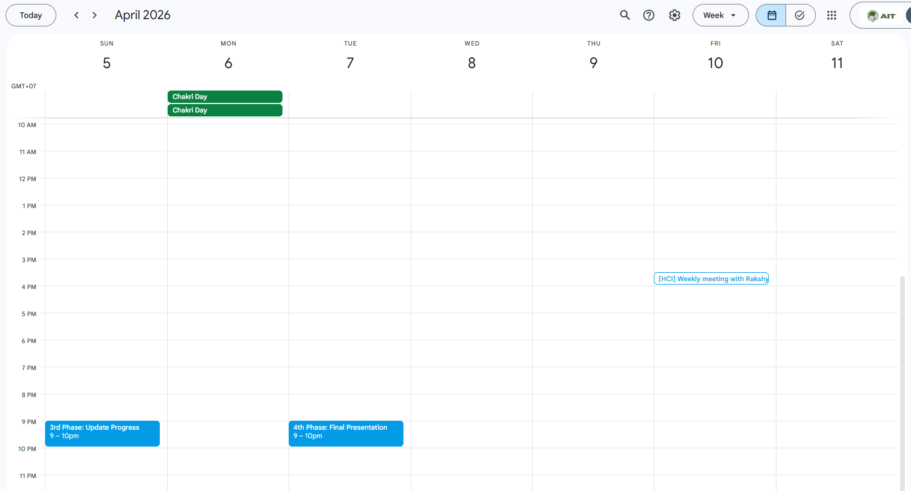

# AT82.05 Natural Language Understanding
## A7: MCP-Server, AI Agent, and External Tool Integration
**Student:** st126522@ait.asia  
**Date:** March 30, 2026

---

## Overview

This assignment builds an integrated AI Agent ecosystem using the Model Context Protocol (MCP). The system moves beyond simple chat to create an agent capable of managing real-world schedules and communicating via Telegram, demonstrating practical NLU through tool use and multi-step reasoning.

**Stack used:**
- n8n (local, via Docker) — workflow orchestration
- ngrok — public tunnel to expose local n8n to the internet
- Groq API (llama-3.3-70b-versatile) — free LLM inference
- Telegram Bot API — messaging interface
- Google Calendar API — schedule management
- MCP (Model Context Protocol) — standardized tool communication layer

---

## Task 1: MCP Infrastructure & Server Setup

### 1.1 Server Deployment 

n8n was deployed locally using Docker with the following command:

```cmd
docker run -it --rm --name n8n -p 5678:5678 \
  -v n8n_data:/home/node/.n8n \
  -e WEBHOOK_URL=https://sesamoid-davina-semipalmate.ngrok-free.dev \
  docker.n8n.io/n8nio/n8n
```

ngrok was used to tunnel the local instance to a public HTTPS URL:

```cmd
ngrok http 5678
```

**Public URL:** `https://sesamoid-davina-semipalmate.ngrok-free.dev`

> 📸 **Screenshot: ngrok terminal showing Forwarding URL**

---

### 1.2 MCP Server Workflow 

A dedicated n8n workflow ("MCP Server") was created with an **MCP Server Trigger** node and three internal tools:

| Tool | Purpose |
|------|---------|
| Calculator | Arithmetic operations |
| Date & Time | Current date/time queries |
| Code | Custom logic via JavaScript |

The MCP Server was published and verified active. Its Production URL:

```
https://sesamoid-davina-semipalmate.ngrok-free.dev/mcp/7b9c7e3c-3166-47ad-bba9-7b487e5076d6
```

Accessing this URL in a browser returns a live SSE response, confirming the server is active and discoverable:

```
event: endpoint
data: /mcp/7b9c7e3c-3166-47ad-bba9-7b487e5076d6?sessionId=59271e39-e036-490e-b4ac-ecc812d238a7
```

> 📸 **Screenshot: MCP Server workflow in n8n (MCP Trigger + 3 tools)**

---

### 1.3 AI Agent Client 

A separate "AI Agent Client" workflow was created with the following configuration:

**Nodes:**
- `When chat message received` — Chat Trigger (input)
- `AI Agent` — core reasoning node
- `Groq Chat Model` — llama-3.3-70b-versatile via Groq API
- `Simple Memory` — maintains conversation context per session
- `MCP Client Tool` — connected to MCP Server Production URL

**MCP Client configuration:**
- Endpoint: `https://sesamoid-davina-semipalmate.ngrok-free.dev/mcp/7b9c7e3c-3166-47ad-bba9-7b487e5076d6`
- Transport: HTTP Streamable

**Verification:** The agent was tested via the n8n chat interface. It successfully used MCP tools — correctly answering arithmetic questions using the Calculator tool and returning current date/time via the Date & Time tool.

> 📸 **Screenshot: AI Agent Client workflow canvas (Chat Trigger → AI Agent → Groq + Memory + MCP Client)**


> 📸 **Screenshot: n8n chat showing agent response using MCP tools (e.g., "What is 25 multiplied by 48?")**

---

## Task 2: Telegram & Google Calendar Integration

### 2.1 Telegram Bot API

A Telegram bot was created via **@BotFather**:
- Bot name: `mcp_ait_bot`
- Bot token added as credentials in n8n

The AI Agent workflow was extended:
- **Telegram Trigger** (`On message`) — replaces Chat Trigger as input
- **Send a text message** node — sends agent response back to the user

**Session and Prompt configuration:**
- Simple Memory Session ID: `{{ $('Telegram Trigger').item.json.message.chat.id }}`
- AI Agent Prompt: `{{ $('Telegram Trigger').item.json.message.text }}`
- Send Message Chat ID: `{{ $('Telegram Trigger').item.json.message.chat.id }}`
- Send Message Text: `{{ $('AI Agent').item.json.output }}`

> 📸 **Screenshot: Telegram workflow canvas (Telegram Trigger → AI Agent → Send message)**

---

### 2.2 Google Calendar Tool 

Google Calendar was integrated as a Tool on the AI Agent:

**Setup steps:**
1. Enabled Google Calendar API on Google Cloud Console
2. Created OAuth 2.0 credentials (Client ID + Secret)
3. Authorized redirect URI: `https://sesamoid-davina-semipalmate.ngrok-free.dev/rest/oauth2-credential/callback`
4. Authenticated via Google OAuth in n8n

**Tool configuration:**
- Resource: Event
- Operation: Create
- Calendar: st126522@ait.asia
- Summary, Start, End: set to "From AI"

### 2.3 Automated Project Scheduling 

The agent was commanded via Telegram to create a 4-phase project schedule. Message sent:

```
Create a project schedule with these 4 phases:
1st Phase: Literature Review on April 1, 2026 at 10am
2nd Phase: Project Proposal on April 3, 2026 at 10am
3rd Phase: Update Progress on April 5, 2026 at 10am
4th Phase: Final Presentation on April 7, 2026 at 10am
```

The agent successfully interpreted the natural language command, called the Google Calendar tool four times (once per phase), and created all events.


> 📸 **Screenshot: Google Calendar showing all 4 phase events created**

---

### 2.4 Interaction Verification

After creating the events, the bot was queried via Telegram to verify the schedule:

> 📸 **Screenshot: Telegram conversation asking the bot to confirm/list the project phases**


> 📸 **Screenshot: Google Calendar view confirming all 4 events are present**


---

## Architecture Summary

```
[Task 1]
Chat UI → Telegram Trigger
              ↓
         AI Agent (Groq llama-3.3-70b)
         ├── Simple Memory (session context)
         └── MCP Client Tool
                   ↓
            MCP Server (n8n workflow)
            ├── Calculator
            ├── Date & Time
            └── Code

[Task 2]
Telegram Message → AI Agent (Groq llama-3.3-70b)
                   ├── Simple Memory
                   └── Google Calendar Tool (OAuth2)
                            ↓
                   Create 4 Calendar Events
                            ↓
                   Reply back via Telegram
```

---

## Key Concepts Demonstrated

**MCP (Model Context Protocol):** A standardized protocol that allows LLMs to discover and call external tools without custom glue code per integration. Analogous to USB — one standard interface, any tool can connect.

**Tool use / Function calling:** The LLM does not execute actions itself. It outputs structured JSON specifying which tool to call and with what parameters. The orchestrator (n8n) reads that JSON and executes the actual API call. The result is fed back to the LLM for reasoning.

**Agentic loop:** The multi-step cycle of: receive input → reason → call tool → receive result → reason again → respond. This is what distinguishes an agent from a single-shot chatbot.